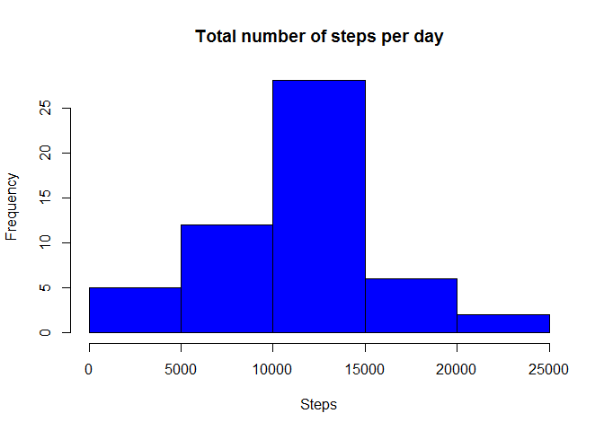
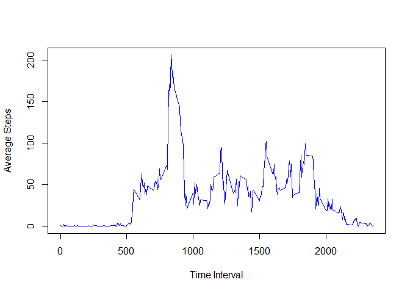
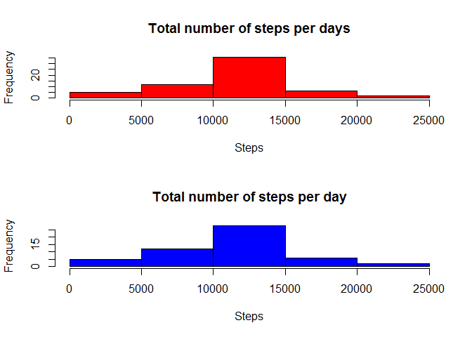
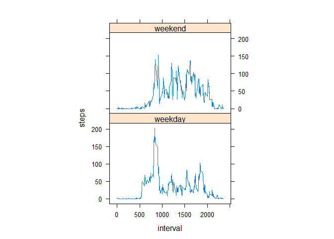

Reproducible Research Course Project 1
======================================

Reading in the data
-------------------

``` r
setwd("G:/Coursera/Data Science/5-Reproducible Research")
dt <- read.csv("activity.csv", colClasses = c("numeric", "character","numeric"))
dt$date <- as.Date(dt$date,"%Y-%m-%d")
head(dt)
```

    ##   steps       date interval
    ## 1    NA 2012-10-01        0
    ## 2    NA 2012-10-01        5
    ## 3    NA 2012-10-01       10
    ## 4    NA 2012-10-01       15
    ## 5    NA 2012-10-01       20
    ## 6    NA 2012-10-01       25

Calculating the total number of steps
-------------------------------------

``` r
total <- aggregate(dt$steps , by= list(dt$date), FUN = sum)
colnames(total) <- c("date","steps")
head(total)
```

    ##         date steps
    ## 1 2012-10-01    NA
    ## 2 2012-10-02   126
    ## 3 2012-10-03 11352
    ## 4 2012-10-04 12116
    ## 5 2012-10-05 13294
    ## 6 2012-10-06 15420

Calculating the mean and the median of the data
-----------------------------------------------

``` r
mstep <- mean(total$steps, na.rm = TRUE)
mstep
```

    ## [1] 10766.19

``` r
median <- median(total$steps, na.rm = TRUE)
median
```

    ## [1] 10765

Plotting the histogram
----------------------

``` r
hist(total$steps, col = "blue", xlab = "Steps", main = "Total number of steps per day")
```

<!-- -->

Time series
-----------

``` r
tseries <- tapply(dt$steps, dt$interval, mean, na.rm = TRUE)
plot(row.names(tseries), tseries,type = "l", col = "blue", xlab = "Time Interval" , ylab = "Average Steps")
```

<!-- -->

``` r
minterval <- which.max(tseries)
names(minterval)
```

    ## [1] "835"

Taking care of missing values
-----------------------------

Replacing the missing values using the mean.

``` r
missing <-sum(is.na(dt$steps))
missing
```

    ## [1] 2304

``` r
newdt <- dt

replaceNA <- aggregate(steps ~ interval , data = newdt, FUN = mean)
for( i in 1:nrow(newdt)) {
  if(is.na(newdt[i,1])) {
    int <- newdt[i,3]
    newdt[i,1] <- replaceNA[replaceNA$interval == int, "steps"]
  }
}
head(replaceNA)
```

    ##   interval     steps
    ## 1        0 1.7169811
    ## 2        5 0.3396226
    ## 3       10 0.1320755
    ## 4       15 0.1509434
    ## 5       20 0.0754717
    ## 6       25 2.0943396

Calculating new median and mean
-------------------------------

``` r
ntotal <- aggregate(newdt$steps , by= list(newdt$date), FUN = sum)
colnames(ntotal) <- c("date","steps")
nmstep <- mean(ntotal$steps)
nmedian <- median(ntotal$steps)
```

Comparing new and old data sets
-------------------------------

``` r
par(mfrow = c(2,1))
hist(ntotal$steps, col = "red" , xlab = "Steps", main = "Total number of steps per days")
hist(total$steps, col = "blue", xlab = "Steps", main = "Total number of steps per day")
```

<!-- -->

Comparing weekdays and weekends
-------------------------------

``` r
bdata <- dt
bdata$steps[is.na(bdata$steps)] <- median(dt$steps, na.rm = TRUE)
bdata <- aggregate(steps ~ date + interval, data = bdata, sum, na.rm = TRUE)

bdata$date <- as.Date(bdata$date)    
bdata$day <- weekdays(bdata$date)
bdata$weekend <- as.factor(ifelse(bdata$day == "Saturday" | bdata$day == "Sunday", "weekend", "weekday"))

library(lattice)
```

    ## Warning: package 'lattice' was built under R version 3.2.3

``` r
plotdata <- aggregate(steps ~ interval + weekend, bdata, mean)
xyplot(steps ~ interval | factor(weekend), data=plotdata, aspect=2/3, type="l" ,layout = c(1,2))
```

<!-- -->
